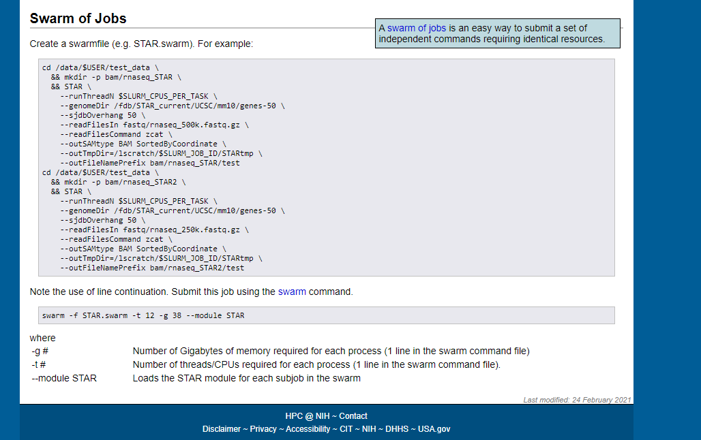

## RNAseq Alignment Review

We discussed the purpose of RNAseq. Depending your RNAseq experiment design, you may want to use an aligner such as STAR or HISAT, or pseudo aligners, Salmon and Kallisto

1. Index your reference genome

> **NOTE** Do not run this

```bash
$ STAR	--runThreadN 2 \
	--runMode genomeGenerate \
	--genomeDir . \
	--genomeFastaFiles GRCh38_chr19.fa \
	--sjdbGTFfile GRCh38_chr19.gtf \
	--sjdbOverhang 149
```

2. Align your raw data

```bash
$ cd ~/Day4

$ STAR	--runThreadN 2 \
	--genomeDir STAR_chr2_genome/ \
	--readFilesIn raw_data/sample1.fastq \
	--quantMode GeneCounts \
	--outFileNamePrefix results/sample1_
```

3. Convert (compress) your sam file to bam

```bash
$ cd ~/Day4/results
$ samtools view -b sample1_Aligned.out.sam > sample1.bam
```

4. Sort your bam file

```bash
$ samtools sort sample1.bam > sample1.sorted.bam
```


5. Index the bam file

```bash
$ samtools index sample1.sorted.bam
```

> This generates the index file that ends with `.bai`. You could then view the bam file in IGV.
Make sure the index is present in the same directory.

## Create an RNAseq script

You could use any text editor to write a script that contains all the steps required
for DNAseq analysis

A good option for a text editor is `gedit`. It only works on X2go. We will cover the `vim`
text editor tomorrow morning.

```bash
$ gedit RNAseq_sample2.sh
```
---

```bash
#!/bin/bash

# BIOF045: 03/25/2021
# This script for RNA alignment, sorting, indexing, and gene count prep

## 0. set up the file structure and change your directory

cd ~/Day4

## 1. STAR alignment with 2 threads

STAR  --runThreadN 2 \
        --genomeDir STAR_chr2_genome/ \
        --readFilesIn raw_data/sample2.fastq \
        --quantMode GeneCounts \
        --outFileNamePrefix results/sample2_

## 2. Convert sam to bam

cd ~/Day4/results
samtools view -b sample2_Aligned.out.sam > sample2.bam

## 3. Sort your bam file using samtools

samtools sort sample2.bam > sample2.sorted.bam


## 4. Index the bam file
###	after this step you could view the bam file in IGV

samtools index sample2.sorted.bam

```

---

After you create the script, you could run it using `source RNAseq_sample2.sh`. This is how you run a script for one STAR alignment, but in reality, multiple alignments are often run at the same time.




Lastly, we will created a gene matrix using the count tables we obtained from STAR output of sample1 and sample2.

```
cut -f1,2 sample1_ReadsPerGene.out.tab > count1.txt
cut -f2 sample2_ReadsPerGene.out.tab > count2.txt

paste count1.txt count2.txt > combined_count.tsv

rm count1.txt count2.txt

```
